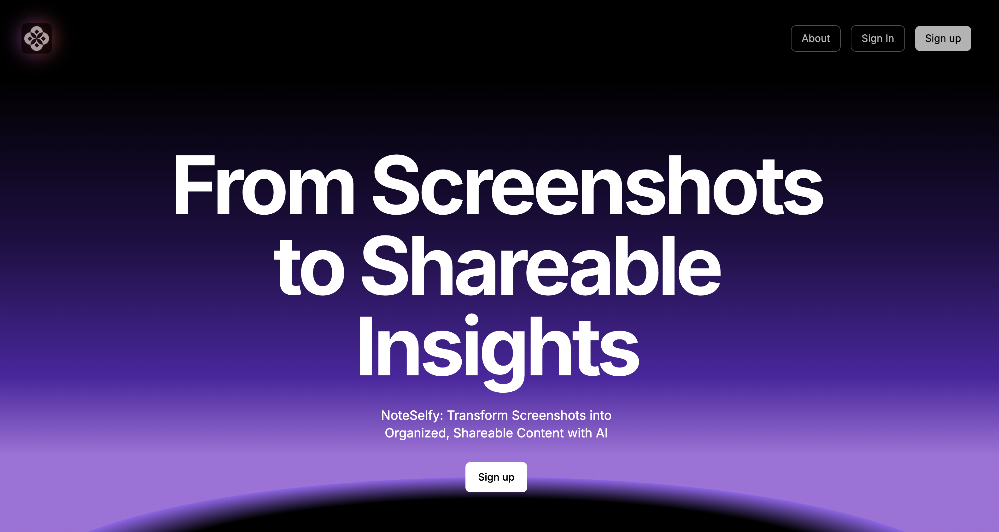
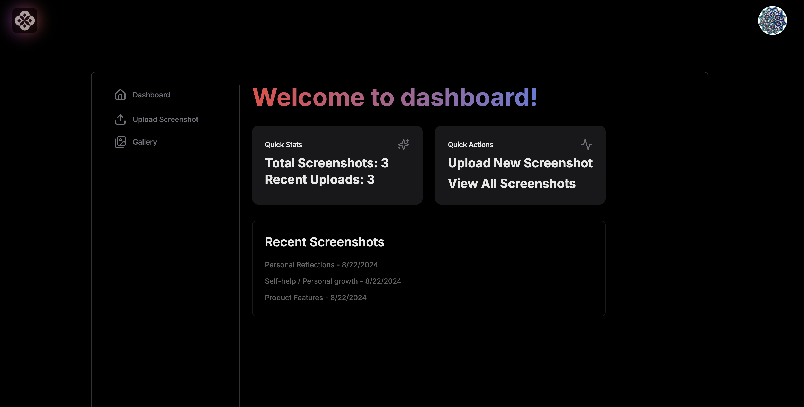
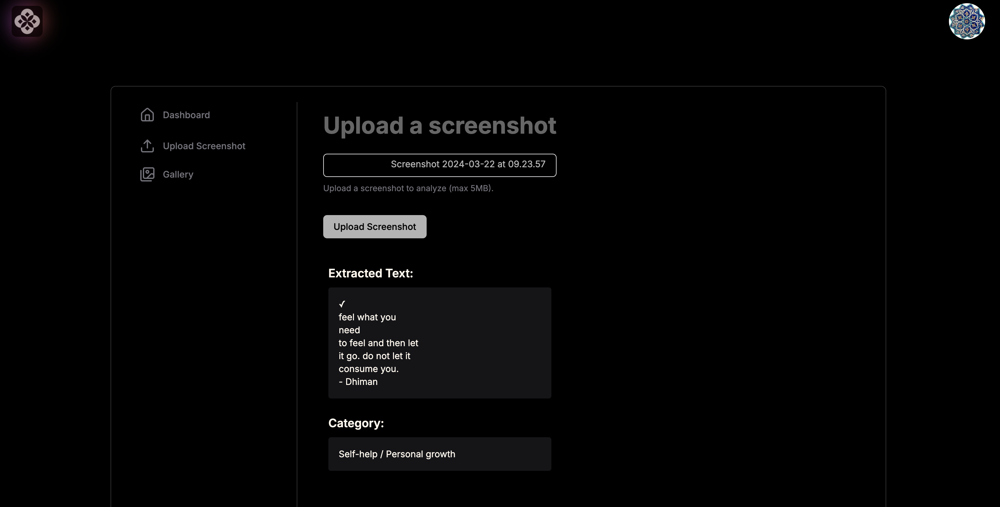
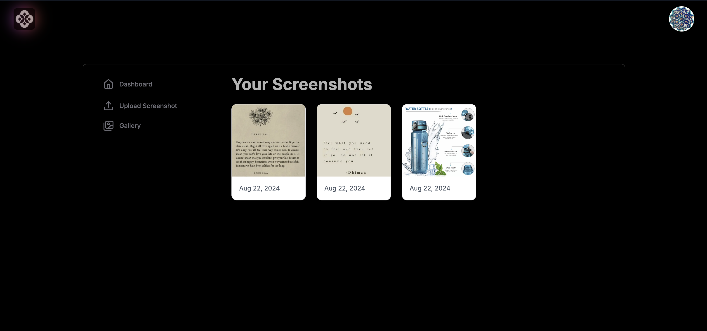
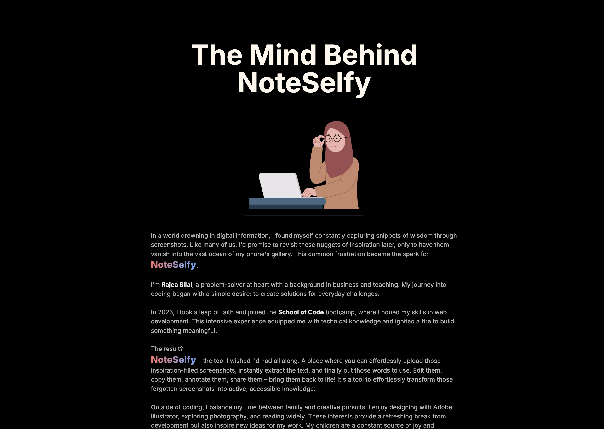
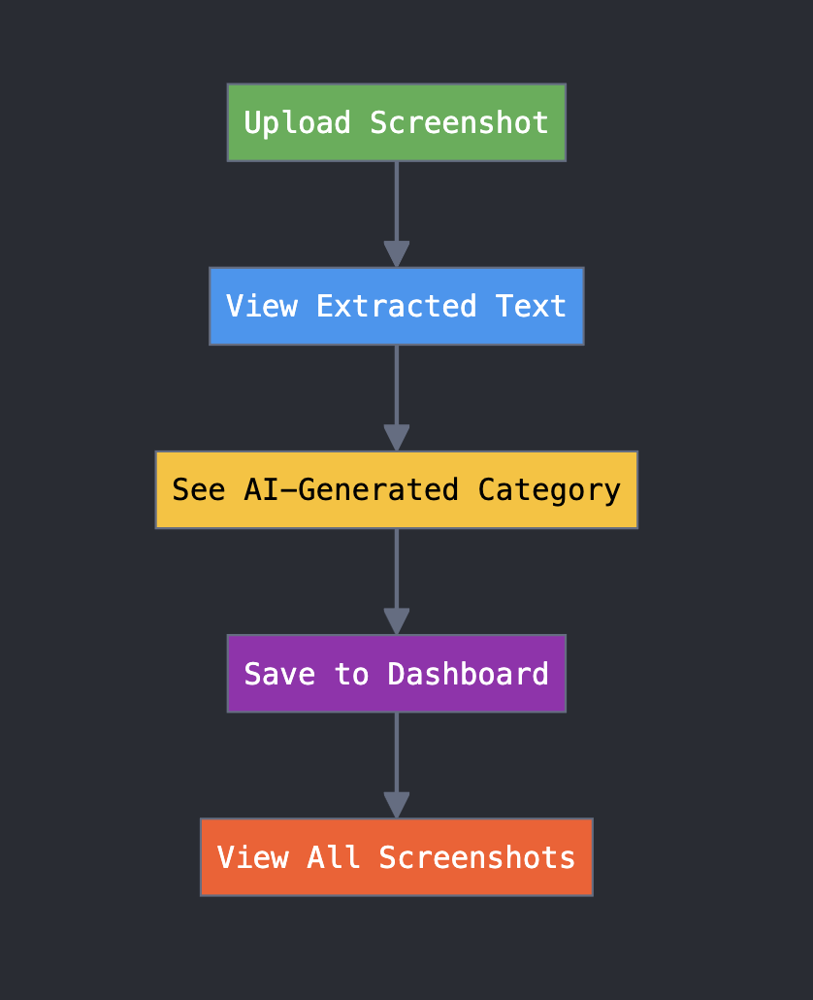

# NoteSelfy



## NoteSelfy is an answer to a problem I faced for many years. 

Its a **web application** that allows users to effortlessly upload screenshots or images, instantly extract the text, and finally put those words to use. Users are able to copy the extracted text, annotate it and share it – bring those words to life! Its a tool to transform those forgotten screenshots into active, accessible knowledge.

It leverages **OCR technology** and **AI-powered categorization** to help users extract and categorize text from images efficiently.

## Features

- Image upload and scanning using **Google Cloud Vision API** for OCR
- Text categorization using **OpenAI's GPT model**
- User authentication via **Clerk** (including Google, GitHub, and Discord sign-in options)
- Personalized user dashboard for viewing and managing uploads
- Image hosting on **Cloudinary**
- Data storage in **PostgreSQL** database hosted on Neon
- Responsive design using **Tailwind CSS**









## Technologies Used

- Next.js
- React
- Node.js
- PostgreSQL
- Prisma ORM
- Google Cloud Vision API
- OpenAI GPT API
- Clerk Authentication
- Cloudinary
- Tailwind CSS
- Neon (for database hosting)

## Installation

1. Clone the repository:
   ```
   git clone https://github.com/yourusername/noteselfy.git
   cd noteselfy
   ```

2. Install dependencies:
   ```
   npm install
   ```

3. Set up environment variables:
   Create a `.env.local` file in the root directory and add the following variables:
   ```
   DATABASE_URL=your_neon_postgres_url
   GOOGLE_CLOUD_VISION_API_KEY=your_google_cloud_vision_api_key
   OPENAI_API_KEY=your_openai_api_key
   CLOUDINARY_CLOUD_NAME=your_cloudinary_cloud_name
   CLOUDINARY_API_KEY=your_cloudinary_api_key
   CLOUDINARY_API_SECRET=your_cloudinary_api_secret
   NEXT_PUBLIC_CLERK_PUBLISHABLE_KEY=your_clerk_publishable_key
   CLERK_SECRET_KEY=your_clerk_secret_key
   ```

4. Set up the database:
   ```
   npx prisma generate
   npx prisma db push
   ```

5. Run the development server:
   ```
   npm run dev
   ```

6. Open [http://localhost:3000](http://localhost:3000) in your browser to see the application.

## Usage

1. Sign up or log in to your NoteSelfy account.
2. Upload a screenshot containing text you want to extract and categorize.
3. View the extracted text and its AI-generated category on your dashboard.
4. Browse through your previous uploads and categories.

## Contact


Developed by **Rajea Bilal**. For any inquiries or feedback, please reach out to me:

- **Email**: rajea.bilal@gmail.com
- **LinkedIn**: [LinkedIn Profile](https://www.linkedin.com/in/rajea-bilal/)
- **GitHub**: [GitHub Profile](https://github.com/rajea-bilal)

Feel free to connect with me if you have any questions about NoteSelfy or if you'd like to discuss potential collaborations!

[MIT](https://choosealicense.com/licenses/mit/)